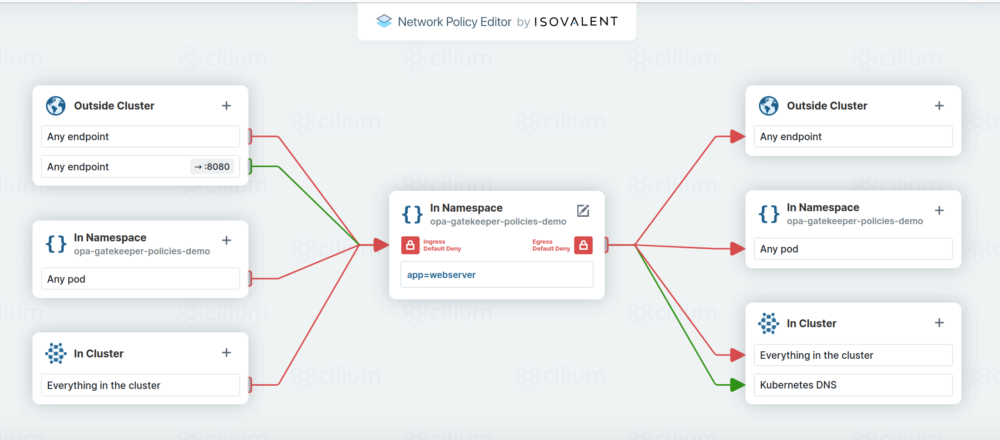

# opa-gatekeeper-policies-demo

Showcases some simple Policy as Code policies in [Elastisys Compliant Kubernetes](https://elastisys.io/compliantkubernetes/).

1. Make sure you have your credentials set up correctly for your Compliant Kubernetes environment.
1. `kubectl apply -f namespace.yaml` to create the Namespace that we will use. It will be a descendant Namespace of the `staging` Namespace, and as such, it will inherit resources and important labels, such as the ones related to Pod Security Admission. See [Compliant Kubernetes documentation on Namespaces](https://elastisys.io/compliantkubernetes/user-guide/namespaces/) for more information.
1. `kubectl config set-context --current --namespace=opa-gatekeeper-policies-demo` to set the Namespace that kubectl works with to our newly created Namespace, so commands are easier.
1. `kubectl apply -f deployment-incomplete.yaml` to attempt to deploy a Deployment that is in violation of several Compliant Kubernetes safeguards, implemented as Policy as Code via OPA Gatekeeper. The policies in question are:
  - [NetworkPolicies required](https://elastisys.io/compliantkubernetes/user-guide/safeguards/enforce-networkpolicies/)
  - [Trusted Registry](https://elastisys.io/compliantkubernetes/user-guide/safeguards/enforce-trusted-registries/)
  - [No :latest tag](https://elastisys.io/compliantkubernetes/user-guide/safeguards/enforce-no-latest-tag/)
  - [No Root](https://elastisys.io/compliantkubernetes/user-guide/safeguards/enforce-no-root/)
  - [Restricted Privileges](https://elastisys.io/compliantkubernetes/user-guide/safeguards/enforce-podsecuritypolicies/)
  - [Resource Requests required](https://elastisys.io/compliantkubernetes/user-guide/safeguards/enforce-resources/)

In fact, you would get this output, re-formatted for easier viewing:

- Warning: would violate PodSecurity "restricted:latest": allowPrivilegeEscalation != false (container "nginx" must set securityContext.allowPrivilegeEscalation=false), unrestricted capabilities (container "nginx" must set securityContext.capabilities.drop=["ALL"]), runAsNonRoot != true (pod or container "nginx" must set securityContext.runAsNonRoot=true), seccompProfile (pod or container "nginx" must set securityContext.seccompProfile.type to "RuntimeDefault" or "Localhost")
- Warning: [elastisys-require-networkpolicy] No matching networkpolicy found. Elastisys Compliant Kubernetes requires that all pods are targeted by NetworkPolicies. Read more at https://elastisys.io/compliantkubernetes/user-guide/safeguards/enforce-networkpolicies/
- Warning: [elastisys-require-harbor-registry] The container named <nginx> does not have an allowed image registry <nginx>, allowed registries are <["harbor.long-running.dev-ck8s.com", "quay.io/jetstack/cert-manager-acmesolver", "quay.io/metallb/controller:v0.13.7", "jaegertracing/jaeger-tracegen", "registry.k8s.io/sig-storage/local-volume-provisioner"]>. Elastisys Compliant Kubernetes requires that all images come from trusted registries. Read more at https://elastisys.io/compliantkubernetes/user-guide/safeguards/enforce-trusted-registries/
- Error from server (Forbidden): error when creating "deployment-incomplete.yaml": admission webhook "validation.gatekeeper.sh" denied the request: [elastisys-container-image-must-not-have-disallowed-tags] The container named <nginx> didn't specify an image tag. Elastisys Compliant Kubernetes requires all images to have tags to avoid the implicit :latest tag. Read more at https://elastisys.io/compliantkubernetes/user-guide/safeguards/enforce-no-latest-tag/
- [elastisys-require-resource-requests] The container named <nginx> has no resource requests. Elastisys Compliant Kubernetes requires resource requests to be set for all containers. Read more at https://elastisys.io/compliantkubernetes/user-guide/safeguards/enforce-resources/

Oh no. But at least we know where to look! So now, let's make it work!

First, we need a reasonable Network Policy. Using the wonderful editor over at https://editor.networkpolicy.io/, we can construct the following:



This has been stored in our repo, so let's apply it:

`kubectl apply -f network-policy.yaml`

We have so far addressed the following safeguards:

  - [NetworkPolicies required](https://elastisys.io/compliantkubernetes/user-guide/safeguards/enforce-networkpolicies/)

Let's now make sure to adhere to the rest of the Compliant Kubernetes safeguards!

Instead of running an **unspecific version** of a **privileged** application (as root) from an **untrusted source**, let's make sure we run a specific version of a non-privileged one from a trusted source. That seems like common sense and does wonders for the software supply chain. So let's change the image specifier from merely reading `nginx` (the `:latest` tag is then implied) to the following:

`harbor.long-running.dev-ck8s.com/opa-gatekeeper-policies-demo/nginx-unprivileged@sha256:483abfdcff1426ff1d2c8a9be9a12569b94c84f66aa2412752be6185866a33cc`

This means we are using a trusted registry, a non-privileged application, and a specific version of it. The software supply chain feels safer already!

To adhere to all best practices, and avoid any confusion, we have to make sure to specify that the user within the container is non-root, which we do as such in the `securityContext` of the container:

```yaml
          securityContext:
            runAsNonRoot: true
```

At this point, we have addressed the following safeguards:

  - [NetworkPolicies required](https://elastisys.io/compliantkubernetes/user-guide/safeguards/enforce-networkpolicies/)
  - [Trusted Registry](https://elastisys.io/compliantkubernetes/user-guide/safeguards/enforce-trusted-registries/)
  - [No :latest tag](https://elastisys.io/compliantkubernetes/user-guide/safeguards/enforce-no-latest-tag/)
  - [No Root](https://elastisys.io/compliantkubernetes/user-guide/safeguards/enforce-no-root/)

Two more to go!

The first, about privilege restriction, can be addressed within the Security Context, by making it look as follows:

```yaml
          securityContext:
            allowPrivilegeEscalation: false
            runAsNonRoot: true
            seccompProfile:
              type: "RuntimeDefault"
            capabilities:
              drop:
                - "ALL"
```

We are now not just running as non-root, we specify that the user shall be blocked by the OS to escalate beyond its normal privileges. We also state that the "RuntimeDefault" Linux Seccomp Profile shall be used ([documented here](https://docs.docker.com/engine/security/seccomp/)), and that all [Linux Capabilities](https://man7.org/linux/man-pages/man7/capabilities.7.html) should be dropped and thus be impossible to request. These are required by the `restricted` (most strict) [Pod Security Standards](https://kubernetes.io/docs/concepts/security/pod-security-standards/).

Let's take care of the last one, as well, which is that we need to specify [Kubernetes resource requests](https://kubernetes.io/docs/concepts/configuration/manage-resources-containers/) as such:

```yaml
          resources:
            requests:
              cpu: 50m
              memory: 128M
            limits:
              cpu: 100m
              memory: 128M
```

At this point, we are done! We have addressed all of the Compliant Kubernetes safeguards that we were violating before:

  - [NetworkPolicies required](https://elastisys.io/compliantkubernetes/user-guide/safeguards/enforce-networkpolicies/)
  - [Trusted Registry](https://elastisys.io/compliantkubernetes/user-guide/safeguards/enforce-trusted-registries/)
  - [No :latest tag](https://elastisys.io/compliantkubernetes/user-guide/safeguards/enforce-no-latest-tag/)
  - [No Root](https://elastisys.io/compliantkubernetes/user-guide/safeguards/enforce-no-root/)
  - [Restricted Privileges](https://elastisys.io/compliantkubernetes/user-guide/safeguards/enforce-podsecuritypolicies/)
  - [Resource Requests required](https://elastisys.io/compliantkubernetes/user-guide/safeguards/enforce-resources/)

As one small addition, which is not a safeguard, we can make our deployment **even more secure** by disallowing it any Kubernetes API access, because we are not supposed to do any such calls. And if we are not supposed to make them, we should not have the permissions to do so. So let's just add one more line to the spec of the Pod spec, namely, `automountServiceAccountToken: false`

The full, working Deployment, is in `deployment.yaml` -- try deploying it, and you will see that it works: `kubectl apply -f deployment.yaml`
